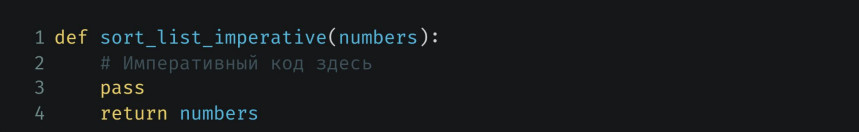
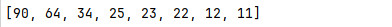
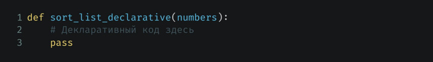
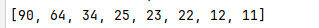

# Парадигмы программирования и языки парадигм
## Урок 1. Императивное и декларативное программирование на практике
**Цели семинара**
- Понять основные отличия между декларативной и императивной парадигмами
- Начать решать задачи в рамках одной выбранной парадигмы
### Домашнее задание
Сортировка списка

Для разогрева на первое домашнее задание будет каноническая задача сортировки списка.

Задача №1 <br>
Дан список целых чисел numbers. Необходимо написать в императивном стиле процедуру для
сортировки числа в списке в порядке убывания. Можно использовать любой алгоритм сортировки.



```
def sort_list_imperative(numbers):
    # Императивный код здесь
    pass
    return numbers
    
```

Результат выполнения кода [файла к заданию 1](11.py):




Задача №2 <br>
Написать точно такую же процедуру, но в декларативном стиле



```
def sort_list_declarative(numbers):
    # Декларативный код здесь
    pass
    
```

Результат выполнения кода [файла к заданию 2](12.py):



<br><br><hr><br>

[Содержание программы README.md](../README.md)

<br><br>