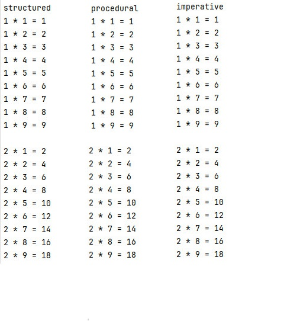

# Парадигмы программирования и языки парадигм
## Урок 2. Структурное и процедурное программирование на практике
**Цели семинара**
- Понять основные отличия между структурной, процедурной и императивной парадигмами
- Начать решать задачи в рамках одной выбранной парадигмы
### Домашнее задание
Таблица умножения

● Условие <br>
На вход подается число n.

● Задача <br>
Написать скрипт в любой парадигме, который выводит на экран таблицу умножения всех чисел от 1 до n.
Обоснуйте выбор парадигм.

● Пример вывода:
```
1 * 1 = 1
1 * 2 = 2
1 * 3 = 3
1 * 4 = 4
1 * 5 = 5
1 * 6 = 6
..

1 * 9 = 9

```

### Решение задания

Структурная парадигма - эта парадигма, которая позволяет легко организовать код с использованием циклов и условных операторов.
Структурная парадигма используется для задач, где требуется последовательное выполнение операций, 
таких как генерация таблицы умножения. <br>
Пример: print_structured [в файле к заданию 2](21.py). <br>
В этом подходе используются циклы и условные операторы для управления потоком выполнения программы.
Программа разбита на функции, которые выполняют определенные задачи, что делает код более организованным и понятным.

Процедурная парадигма - это разделение кода на функции делает его более модульным и легким для тестирования и повторного использования, 
когда нужно выделить отдельные части логики, такие как, например, умножение чисел. <br>
Пример: printe_procedural с использованием вспомогательной функции multiply [в файле к заданию 2](21.py). <br>
Этот подход акцентирует внимание на вызове процедур или функций.
Программа разбита на небольшие процедуры, которые можно вызывать многократно, что способствует повторному использованию кода.

Императивная парадигма - эта парадигма, которая позволяет явно управлять состоянием программы, 
что может быть полезно для задач, где требуется точный контроль над порядком выполнения операций. <br>
Пример: print_imperative [в файле к заданию 2](21.py). <br>
В этом подходе программа представляет собой последовательность инструкций, которые изменяют состояние программы.
Используются циклы и переменные для управления состоянием.



<br><br><hr><br>

[Содержание программы README.md](../README.md)

<br><br>
