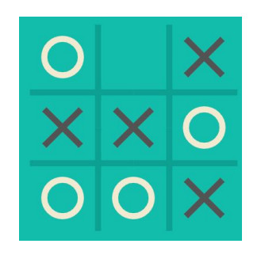

# Парадигмы программирования и языки парадигм
## Урок 3. ООП на практике
**Цели семинара**
- Понять основные отличия между ООП и уже известными парадигмами
- Научиться принимать решение об использовании ООП в конкретной задаче
- Научиться решать задачи в рамках ООП парадигмы
### Домашнее задание
Крестики-нолики

● Контекст  
Вероятнее всего, вы с детства знакомы с этой игрой. Пришло
время реализовать её. Два игрока по очереди ставят крестики
и нолики на игровое поле. Игра завершается когда кто-то
победил, либо наступила ничья, либо игроки отказались
играть.

● Задача  
Написать игру в “Крестики-нолики”. Можете использовать
любые парадигмы, которые посчитаете наиболее
подходящими. Можете реализовать доску как угодно - как
одномерный массив или двумерный массив (массив массивов).
Можете использовать как правила, так и хардкод, на своё
усмотрение. Главное, чтобы в игру можно было поиграть через
терминал с вашего компьютера.

  
 

[Содержание программы README.md](../README.md)

  
