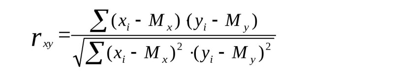
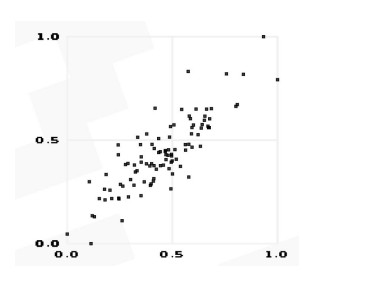

# Парадигмы программирования и языки парадигм
## Урок 4. Функциональное программирование
**Цели семинара**
- Понять основные отличия между функциональной парадигмой и уже известными парадигмами
- Научиться принимать решение об использовании функциональной парадигмы в конкретной задаче
- Научиться решать задачи в рамках функциональной парадигмы
### Домашнее задание
Корреляция

● Контекст  
Корреляция - статистическая мера, используемая для оценки
связи между двумя случайными величинами.

● Ваша задача  
Написать скрипт для расчета корреляции Пирсона между
двумя случайными величинами (двумя массивами). Можете
использовать любую парадигму, но рекомендую использовать
функциональную, т.к. в этом примере она значительно
упростит вам жизнь.

● Формула корреляции Пирсона:

### Решение задания

1. Вычисление среднего значения (функция mean):
- Вычисляем среднее значение массива.
- Используем функцию reduce для суммирования элементов массива и делим на количество элементов.
2. Вычисление ковариации (функция covariance):
- Вычитаем среднее значение из каждого элемента массива.
- Умножаем соответствующие элементы двух массивов, используем map для вычисления произведения отклонений каждой пары элементов от их средних значений.
- Суммируем произведения, чтобы получить ковариацию.
3. Вычисление стандартного отклонения (функция std_deviation):
- Вычитаем среднее значение из каждого элемента массива.
- Возводим в квадрат и суммируем, используем map для вычисления квадратов отклонений каждого элемента от среднего.
- Делим на количество элементов и берем квадратный корень для получения стандартного отклонения.
4. Вычисление коэффициента корреляции Пирсона (функция pearson_correlation):
- Вычисляем коэффициент корреляции Пирсона.
- Используем ранее определенные функции для вычисления ковариации и стандартных отклонений.
- Делим ковариацию на произведение стандартных отклонений.

[**Реализация кода:**](41.py)

Два массива x и y, где результат вычисления коэффициента корреляции Пирсона показывает,   
что массивы имеют линейную зависимость, так как коэффициент корреляции близок к 1.

  
 

[Содержание программы README.md](../README.md)

  