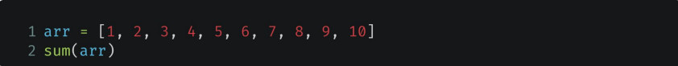
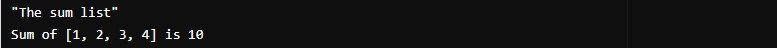

# Парадигмы программирования и языки парадигм
## Урок 5. Логическое программирование
**Цели семинара**
- Научиться применять парадигмы программирования на практике
### Домашнее задание
Сумма элементов списка

● Контекст <br>
Мы уже видели множество решений этой задачи в различных
стилях. Пришло время решить её с помощью логической
парадигмы.

● Ваша задача <br>
Написать программу на языке Prolog для вычисления суммы
элементов списка. На вход подаётся целочисленный массив.
На выходе - сумма элементов массива.

● Пример на языке Python в функциональной парадигме:



```
arr = [1, 2, 3, 4, 5, 6, 7, 8, 9, 10]
sum(arr)

```

### Решение задания

Создаем файл с кодом в файле, например, [51.pl](51.pl). <br>
Этот код соответствует функциональной парадигме, так как использует рекурсию и не изменяет состояние данных. <br>
Предикат sum_list/2 определяет, что сумма пустого списка равна 0, это базовый случай рекурсии. <br>
Если список не пустой, он разбивается на голову (Head) и хвост (Tail). Рекурсивно вычисляется сумма элементов хвоста. <br>
Сумма текущего элемента (Head) и суммы хвоста (TailSum) вычисляется и сохраняется в переменной Sum.

<br><hr><br>

Для работы с файлом можно использовать онлайн редактор (интерпретатор): <br>
[swi-prolog.org](https://swish.swi-prolog.org/), <br>
[tutorialspoint.com/execute_prolog_online.php](https://www.tutorialspoint.com/execute_prolog_online.php), <br>
[ideone.com/l/prolog-swi](https://ideone.com/l/prolog-swi), <br>
[onecompiler.com/prolog](https://onecompiler.com/prolog) <br>
Можно установить Prolog на Windows.

###  Установка Prolog на Windows

1. Перейти на официальный сайт SWI-Prolog [swi-prolog.org](https://www.swi-prolog.org/Download.html). В разделе "Windows" выберать версию для Windows 10 (обычно это 64-bit версия).
2. После загрузки файла, запустить его. Следуя инструкциям мастера установки, выбрать стандартные настройки.
3. После установки Prolog добавить путь к SWI-Prolog в системную переменную PATH для удобного запуска из командной строки. <br>
Для этого открыть "Панель управления" -> "Система и безопасность" -> "Система" -> "Дополнительные параметры системы".
В открывшемся окне нажать "Переменные среды" и в разделе "Системные переменные" найти переменную Path.
Нажать "Изменить" и добавить путь к папке, где установлен SWI-Prolog (например, C:\Program Files\swipl\bin).
4. Запустить SWI-Prolog, для этого открыть командную строку (CMD) и ввести swipl, чтобы запустить интерпретатор Prolog.


<br><hr><br>

### Работа с файлом в консоли:

1. Установить Prolog, то есть установить интерпретатор Prolog, например, [SWI-Prolog](https://www.swi-prolog.org/Download.html).
2. Создать файл с рассширением .pl
3. Открыть терминал и запустить интерпретатор Prolog, введя команду 
```
swipl
```


4. В консоли Prolog загрузить файл с помощью команды:
```
[sum_list]

```

5. Теперь вызвать предикат sum_list/2 со списком. Например:
```
sum_list([1, 2, 3, 4], Sum)

```

6. Prolog выведет значение переменной Sum, которое будет равно сумме элементов списка.



<br><hr><br>

### Инструкция для языка Prolog

- **predicate_name(X)** — предикат predicate_name истинен тогда, когда истинен X. <br>
- **predicate_name(X, Y)** — предикат predicate_name истинен тогда, когда истинны и X и Y одновременно. <br>
- С маленькой буквы пишутся значения (имена собственные). <br>
- С большой буквы пишутся переменные (объекты, принимающие несколько значений). <br>
- [X|H] — вертикальная черта означает разделение на “первую переменную X” и “H – всего что после X”. <br>
- [_|H] — нижнее подчеркивание означает “любая переменная”, без имени. <br>
- **reverse(List1, List2)** - встроенный метод, возвращающий true, когда список “развернутых” значений List2
полностью совпадает с List1. <br>
- В конце высказывания ставится точка. В начале запроса пишется знак вопроса и минус “?-”. <br>

**Больше информации по синтаксису языка Prolog на сайте [https://www.swi-prolog.org](https://www.swi-prolog.org)**

<br><br><hr><br>

[Содержание программы README.md](../README.md)

<br><br>