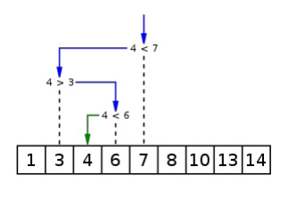

# Парадигмы программирования и языки парадигм
## Урок 6. Парадигмы программирования на практике.
**Цели семинара**
- Понять основные отличия между декларативной и императивной парадигмами
- Начать решать задачи в рамках одной выбранной парадигмы
### Домашнее задание
Бинарный поиск

● Контекст  
Предположим, что мы хотим найти элемент в массиве (получить
его индекс). Мы можем это сделать просто перебрав все элементы.
Но что, если массив уже отсортирован? В этом случае можно
использовать бинарный поиск. Принцип прост: сначала берём
элемент находящийся посередине и сравниваем с тем, который мы
хотим найти. Если центральный элемент больше нашего,
рассматриваем массив слева от центрального, а если больше -
справа и повторяем так до тех пор, пока не найдем наш элемент.

● Ваша задача  
Написать программу на любом языке в любой парадигме для
бинарного поиска. На вход подаётся целочисленный массив и
число. На выходе - индекс элемента или -1, в случае если искомого
элемента нет в массиве.

  
 